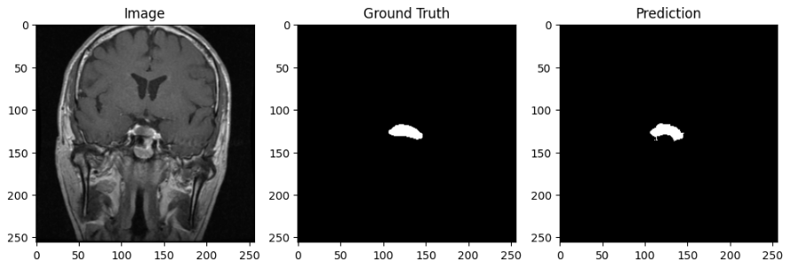

# Brain Tumor Segmentation using U-Net (PyTorch)

## Overview
This project implements a U-Net convolutional neural network for brain tumor segmentation from MRI scans using PyTorch.  
The model is trained to predict tumor masks from MRI images and is evaluated using the Dice coefficient, a common metric for medical image segmentation.

This project was built to understand the full deep learning pipeline, including model architecture, data loading, training, evaluation, and prediction visualization.

---

## Model
- Architecture: U-Net
- Loss Function: BCE + Dice Loss
- Optimizer: Adam
- Evaluation Metric: Dice Score
- Framework: PyTorch

U-Net is a convolutional neural network designed for biomedical image segmentation. It uses an encoder–decoder structure with skip connections to preserve spatial information.

---

## Results
The model achieved a Dice score of approximately **0.80** on the validation set.

The model is able to correctly detect tumor regions and produce segmentation masks that closely match the ground truth.

---

## Example Prediction
Below is an example of the model’s prediction compared to the ground truth mask.

---